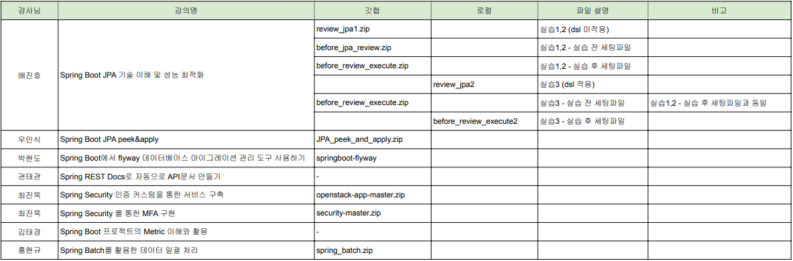

# 1st-open

첫번째 두번째 실습 강의 필요 파일
review_jpa1.zip : 첫번째 최종(dsl 미 적용)
실습 전 세팅 파일 : before_jpa_review.zip
실습 후 세팅 파일 : befroe_review_execute.zip

세번째 실습 강의 파일
review_jpa1.zip : 두번째 최종(dsl 적용)
실습 전 세팅 파일 : befroe_review_execute.zip
실습 후 세팅 파일 : befroe_review_execute2.zip

JPA_peek_and_appy.zip

- 해당 강좌에 사용한 소스코드입니다. 1번 파일은 이론 강의중 사용할 파일이며, 두번째 파일은 라이브코딩으로 코딩한 파일입니다.

## Spring Security 강의 실습 파일

- security-master.zip은 Spring Security를 활용함 MFA 구현 소스
- openstack-app-master.zip은 Spring Security를 활용한 OpenStack 연동
- oauth2-master.zip은 Spring Security 를 활용한 OAuth Framework Server Side 구현

 
 

## 스프링 아카데미아 - 파일 구조 설명

 

